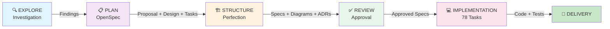

# Tools & Techniques Roadmap: Third-Party Seller Marketplace

## Phase Timeline & Technique Adoption



---

## Technique Adoption by Phase

### Phase 1: EXPLORE (Kickoff)
```
┌─────────────────────────────────────┐
│ 🎯 Core Techniques                  │
├─────────────────────────────────────┤
│ ✓ Codebase exploration              │
│ ✓ Requirement discovery             │
│ ✓ Problem space mapping             │
└─────────────────────────────────────┘
    ↓
┌─────────────────────────────────────┐
│ 🛠️ AI Tools Used                    │
├─────────────────────────────────────┤
│ • Copilot (search, analysis)        │
│ • Grep/Glob (pattern matching)      │
│ • Manual codebase review            │
└─────────────────────────────────────┘
```

### Phase 2: PLAN (OpenSpec Framework)
```
┌─────────────────────────────────────┐
│ 🎯 Core Techniques                  │
├─────────────────────────────────────┤
│ ✓ Spec-Driven Development (SDD)    │
│ ✓ Requirements breakdown            │
│ ✓ Design documentation              │
│ ✓ Implementation task mapping       │
└─────────────────────────────────────┘
    ↓
┌─────────────────────────────────────┐
│ 🛠️ AI Tools Used                    │
├─────────────────────────────────────┤
│ • OpenSpec CLI (propose, explore)   │
│ • Generalist Agent (design docs)    │
│ • Copilot (refinement)              │
└─────────────────────────────────────┘
    ↓
📦 OUTPUTS:
  • proposal.md (business case)
  • design.md (architecture decisions)
  • tasks.md (78 implementation tasks)
  • 8 capability specs
```

### Phase 3: STRUCTURE PERFECTION ⭐ (Most Sophisticated)
```
┌──────────────────────────────────────────────────┐
│ 🎯 Core Techniques                               │
├──────────────────────────────────────────────────┤
│ ✓ Architecture Decision Records (ADRs)           │
│ ✓ API Contract-First Design                      │
│ ✓ Event-Driven Architecture                      │
│ ✓ RBAC/Authorization Matrix                      │
│ ✓ Test Strategy Definition                       │
│ ✓ Cross-Document Consistency Verification        │
└──────────────────────────────────────────────────┘
    ↓
┌──────────────────────────────────────────────────┐
│ 🛠️ AI Tools Used (Parallel Fleet Mode)           |
├──────────────────────────────────────────────────┤
│ ORCHESTRATION:                                   │
│ • Orchestrator Session (central coordinator)     │
│ • SQL Todo Tracking (dependency graph)           │
│ • Fleet mode (parallel execution)                │
│                                                  │
│ SUB-AGENTS (14 parallel):                        │
│ • 4 x ADR Generators (Haiku 4.5)                 │
│ • 2 x Diagram Creators (Haiku 4.5)               │
│ • 4 x API Contract Writers (Haiku 4.5)           │
│ • 1 x Authorization Matrix (Haiku 4.5)           │
│ • 1 x Testing Strategy (Haiku 4.5)               │
│ • 1 x Event Schema Registry (Haiku 4.5)          │
│                                                  │
│ REVIEW FLEET (5 parallel):                       │
│ • 5 x Validation Agents (Haiku 4.5)              │
│   - ADR quality checker                          │
│   - Diagram validator                            │
│   - API contract reviewer                        │
│   - Auth/Testing aligner                         │
│   - Cross-consistency auditor                    │
│                                                  │
│ INFRASTRUCTURE:                                  │
│ • Worktree isolation (per-agent)                 │
│ • Git stacked PRs (gh-stack)                     │
│ • Commit coordination                            │
└──────────────────────────────────────────────────┘
    ↓
📦 OUTPUTS (14 artifacts):
  ├─ 4 ADRs
  ├─ 3 Diagrams (Mermaid)
  ├─ 5 API Contracts (OpenAPI)
  ├─ 1 RBAC Matrix
  ├─ 1 Testing Strategy
  └─ Consistency Review Report
```

### Phase 4: REVIEW (Approval Gate)
```
┌─────────────────────────────────────┐
│ 🎯 Core Techniques                  │
├─────────────────────────────────────┤
│ ✓ Stakeholder review                │
│ ✓ Gap identification                │
│ ✓ Spec refinement                   │
└─────────────────────────────────────┘
    ↓
┌─────────────────────────────────────┐
│ 🛠️ AI Tools Used                    │
├─────────────────────────────────────┤
│ • PR review (GitHub)                │
│ • Feedback capture (Linear issues)  │
│ • Copilot refinement (as needed)    │
└─────────────────────────────────────┘
```

### Phase 5: IMPLEMENTATION (Ready to Start)
```
┌──────────────────────────────────────────────────┐
│ 🎯 Core Techniques                               │
├──────────────────────────────────────────────────┤
│ ✓ Test-Driven Development (TDD)                 │
│ ✓ API-First implementation                      │
│ ✓ Contract-based testing                        │
│ ✓ Event-driven integration                      │
│ ✓ Authorization-first coding                    │
└──────────────────────────────────────────────────┘
    ↓
┌──────────────────────────────────────────────────┐
│ 🛠️ AI Tools to Use                              │
├──────────────────────────────────────────────────┤
│ IMPLEMENTATION FLEET:                           │
│ • 4-5 Code Generation Agents (Opus 4.8)        │
│   - Sellers.API (1 agent)                      │
│   - Catalog.API extensions (1 agent)           │
│   - Ordering.API extensions (1 agent)          │
│   - Database migrations (1 agent)              │
│   - Event handlers (1 agent)                   │
│                                                │
│ TESTING FLEET (parallel):                      │
│ • Unit test generators (Haiku 4.5)             │
│ • Integration test generators (Haiku 4.5)      │
│ • Contract test generators (Haiku 4.5)         │
│                                                │
│ QUALITY GATES:                                 │
│ • Code review agents (Opus 4.8)                │
│ • Security review (specialized)                │
│ • Performance analysis                         │
│                                                  │
│ COORDINATION:                                    │
│ • Implementation Orchestrator                  │
│ • Dependency manager                           │
│ • Integration tester                           │
└──────────────────────────────────────────────────┘
```

---

## Techniques by Category

### 📐 Architecture & Design Patterns
```
ESTABLISHED (Current Use)
├─ Spec-Driven Development ✓
├─ Architecture Decision Records (ADRs) ✓
├─ API-First/Contract-Driven Design ✓
├─ Event-Driven Architecture ✓
├─ Microservices Pattern ✓
├─ RBAC Authorization ✓
└─ Stacked PRs (Git workflow) ✓

READY FOR IMPLEMENTATION
├─ Test-Driven Development (TDD)
├─ Domain-Driven Design (DDD)
├─ CQRS (Command Query Responsibility)
└─ Event Sourcing (Phase 2+)
```

### 🤖 AI/Agent Patterns
```
ESTABLISHED (Current Use)
├─ Parallel Fleet Execution ✓
├─ Model-Appropriate Selection ✓
│  (Haiku for docs, Opus for reasoning)
├─ Orchestrator Pattern ✓
├─ Worktree Isolation ✓
├─ SQL Todo Tracking ✓
└─ Review Automation ✓

READY FOR IMPLEMENTATION
├─ Code Generation Agents
├─ Test Generation Agents
├─ Security Review Agents
├─ Performance Analysis Agents
└─ Integration Testing Agents
```

### 🛠️ Tool Stack
```
ESTABLISHED
├─ OpenSpec (spec framework)
├─ gh-stack (stacked PRs)
├─ GitHub (source control)
├─ Mermaid (diagrams)
├─ OpenAPI (contracts)
└─ SQL (state management)

READY FOR USE
├─ Copilot (code generation)
├─ CodeReview Agent (QA)
├─ Security Scanner (compliance)
├─ Linear (issue tracking)
└─ MCP Servers (external integrations)
```

---

## Confidence & Maturity Levels

```
Phase 3: STRUCTURE PERFECTION
┌──────────────────────────────────────┐
│ Confidence in Techniques             │
├──────────────────────────────────────┤
│ Spec-Driven Development      ████ 95%│
│ Parallel Fleet Execution     ████ 94%│
│ ADR/Design Patterns          ████ 96%│
│ API Contracts                ████ 98%│
│ Cross-Consistency Validation ████ 95%│
│ Overall Readiness for Impl.  ████ 95%│
└──────────────────────────────────────┘
```

---

## Deployment: Techniques to Production

```
FLOW: Techniques → Code → Testing → Review → Deployment

Spec-Driven → API Contracts
             ↓
Code Generation Agents (Opus)
             ↓
Contract Tests (Haiku)
             ↓
Integration Tests (Haiku)
             ↓
Code Review Agents (Opus)
             ↓
Security Review (Specialized)
             ↓
Human Approval
             ↓
Merge to Main
             ↓
🚀 PRODUCTION
```

---

## Key Learnings & Future Roadmap

### ✅ What Worked Well
- **Parallel fleet execution** dramatically reduced documentation time (1 day vs. 5-7 days)
- **Haiku 4.5 for structured docs** (cost-effective, fast, quality)
- **Orchestrator pattern** for coordinating 14+ parallel agents
- **Spec-first approach** caught architectural misalignments early
- **Cross-document validation** prevented downstream rework

### 🔄 Continuous Improvement
- Implement **worktrees per agent** for all future parallel work
- Use **model-appropriate selection** consistently (Haiku for docs, Opus for reasoning)
- Build **reusable agent prompts** for common patterns
- Establish **confidence scoring** for all AI-generated artifacts
- Document **fleet patterns** as project best practices

### 🚀 Next Frontier
- **Code generation at scale** (78 implementation tasks)
- **Test automation fleet** (unit + integration + contract)
- **Security review agents** (specialized scanning)
- **Performance optimization agents** (post-implementation)
- **Multi-repository coordination** (if scaling to multiple services)
