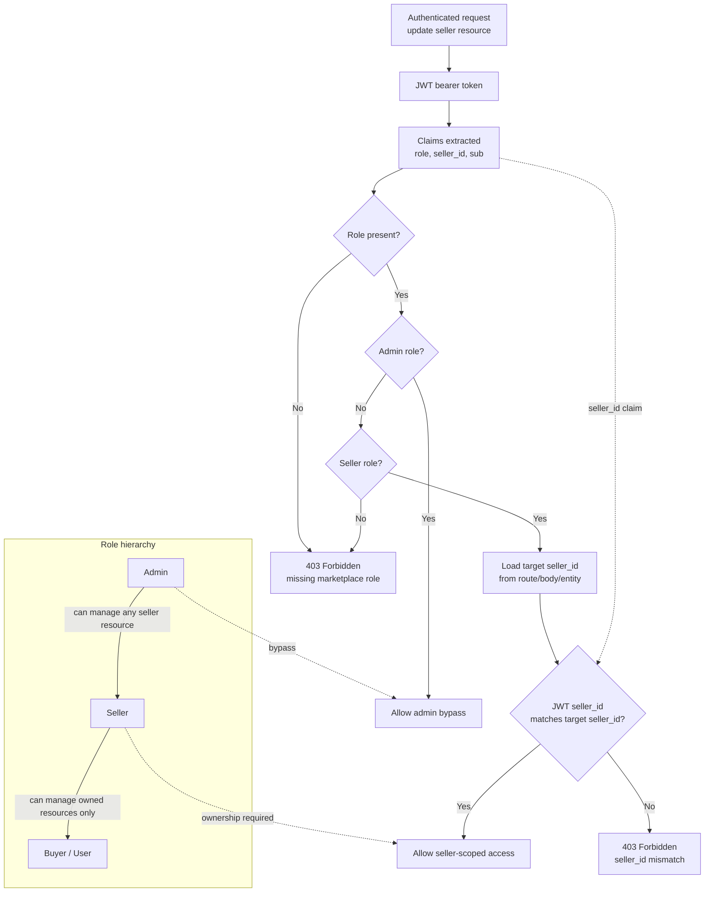

# Authorization Flow

This diagram captures seller-scoped authorization using JWT claims, ownership checks, and an administrator bypass.

## Authorization Rules

- Seller tokens must include a `seller_id` claim and the `Seller` role.
- Requests targeting seller-owned resources compare the JWT `seller_id` with the route, payload, or loaded entity owner.
- If the seller IDs do not match, the request is rejected with `403 Forbidden`.
- `Admin` users bypass seller ownership checks and can operate on any seller resource.
