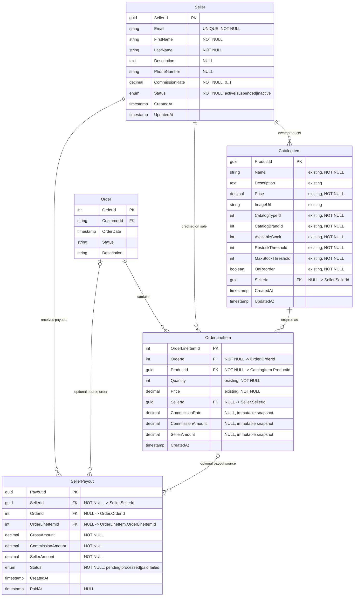

# Database Schema ER Diagram

This diagram captures the proposed marketplace schema updates for seller ownership, immutable order-time commission snapshots, and payout ledger tracking.

## Referential Integrity Notes

- `CatalogItem.SellerId` is nullable to preserve platform-owned catalog items; `NULL` means the product is owned by the platform.
- `OrderLineItem` stores `SellerId`, `CommissionRate`, `CommissionAmount`, and `SellerAmount` as immutable order-time snapshots for auditability and reconciliation.
- `SellerPayout` references `Seller` as required, while `Order` and `OrderLineItem` remain optional to support current per-line payouts and future batched payout workflows.

> Data lifecycle: Seller status changes to `suspended` → Orders referencing that seller still show commission (immutable); new orders from suspended sellers are rejected.
