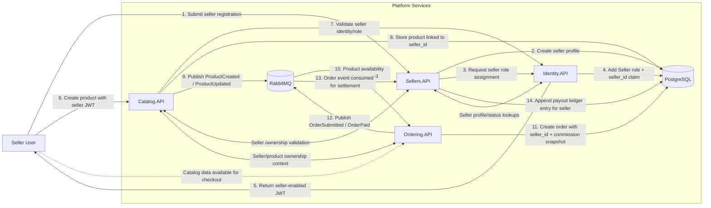

# Service Integration Flow

This diagram summarizes the end-to-end marketplace seller flow across identity, seller management, catalog publishing, ordering, and payout tracking.

## Flow Notes

- `Identity.API` issues JWTs containing the `Seller` role and a `seller_id` claim after registration is approved.
- `Catalog.API` persists seller-owned products and emits catalog events through RabbitMQ for downstream consumers.
- `Ordering.API` stores immutable order-time seller tracking, including seller ownership and commission context.
- `Sellers.API` consumes order events to maintain the payout ledger in PostgreSQL for reconciliation and disbursement workflows.
